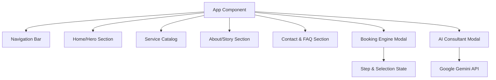
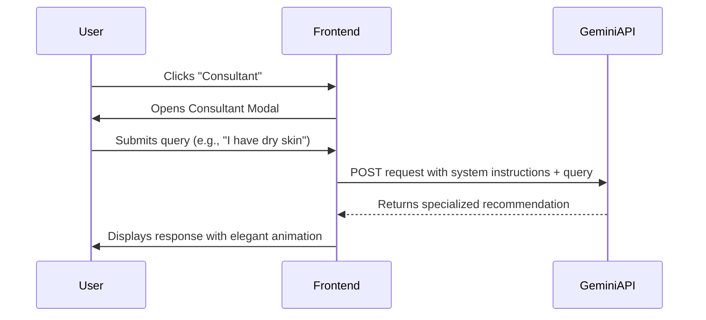

# The BEAUTY CORNER | Technical Documentation

## 1. Executive Summary
**The Beauty Corner** is a high-end, digital-first luxury salon platform designed to provide a seamless bridge between artisanal beauty services and modern client convenience. The application leverages a sophisticated tech stack (React, Framer Motion, and Google Gemini AI) to deliver an immersive, responsive, and intelligent user experience.

---

## 2. Core Functionalities

### 2.1 Bespoke Home & Narrative Experience
*   **Dynamic Hero Interface**: Utilizes *Swiper.js* with fade effects to present high-fidelity brand imagery and immediate Calls to Action (CTA).
*   **The Journey to You**: A structured process guide that minimizes client friction by explaining the "Consult-Transform-Radiate" workflow.

### 2.2 Dynamic Service Catalog
*   **Categorized Menu**: Treatments are grouped into specialized domains (Hair, Skin, Nails) with localized ZAR pricing and duration estimates.
*   **Hover-State Interactivity**: Motion-enhanced cards provide visual feedback, encouraging exploration.

### 2.3 Intelligent Virtual Consultant (AI)
*   **Gemini AI Integration**: A dedicated "Consultant" portal triggered from the Navigation Bar.
*   **Natural Language Processing**: Powered by the `gemini-3-flash-preview` model, it provides bespoke treatment recommendations based on user-described concerns or moods.
*   **Contextual Awareness**: The AI is instructed to maintain a luxury tone and provide pricing in the local currency (ZAR).

### 2.4 Seamless Booking Engine
*   **Multi-Step Modal**: A 3-tier booking process (Service Selection -> Date/Time Scheduling -> Client Information).
*   **Persistent State Summary**: A sidebar within the modal tracks user selections in real-time to ensure accuracy before confirmation.

---

## 3. System Architecture

### 3.1 Component Hierarchy

### 3.2 Booking Workflow Logic
The booking engine operates as a finite state machine with three primary states:
1.  **State 1 (CATALOG)**: Filters and displays services from the `SERVICES` constant.
2.  **State 2 (TEMPORAL)**: Handles date validation and time-slot availability simulation.
3.  **State 3 (IDENTITY)**: Collects user PII (Personally Identifiable Information) and triggers final confirmation.

### 3.3 AI Interaction Flow

---

## 4. Technical Specifications

*   **Framework**: React 18 (ESM via esm.sh)
*   **Styling**: Tailwind CSS (Utility-first responsive design)
*   **Animations**: Framer Motion (Orchestration and physics-based transitions)
*   **AI SDK**: @google/genai (Gemini 3 integration)
*   **Typography**: Playfair Display (Serif headings) & Inter (Sans-serif body)
*   **Icons**: Lucide React (Vector-based accessibility)

---

## 5. Deployment & Configuration
The application is designed for instant ESM resolution, requiring no complex build step for modern browsers.
*   **API Configuration**: Requires `process.env.API_KEY` for Google Generative AI functionality.
*   **Permissions**: Metadata configured for camera access (future-proofing for potential AR skin analysis features).

---
*Professionalism, hygiene, and luxury in every line of code.*